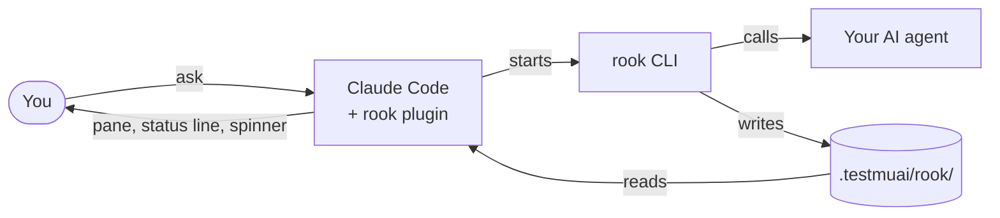

# rook plugin for Claude Code — User Guide

Written in ASD-STE100 Simplified Technical English. For a guided tour with screenshots, read [Getting started](getting-started.md). For a plain-words overview, open [the explainer](explainer.html).

## Purpose

The rook plugin connects Claude Code to rook. Rook is the agent-testing tool from TestMu AI. With the plugin, Claude can test the AI agent that you build. Claude can also read the results and fix the agent.

The plugin does these tasks:

- It runs rook scenarios against your agent.
- It shows the results in a live pane, in the status line and in the spinner.
- It groups failures into clusters and shows the cause and the remedy from rook.
- It tells you the next setup step when rook is not ready.
- It stops runs against a target that looks like production.

The plugin does not change rook. It uses only the rook command line (CLI) and the files that rook writes in the `.testmuai/rook/` folder.

You talk to Claude Code. The plugin starts the rook CLI, and rook calls your agent. Rook writes the results to files. The plugin reads these files and shows them to you.

## Before you start

Make sure that you have these items:

| Item | Requirement |
| --- | --- |
| Claude Code | Version 2.1.288 or newer |
| rook CLI | Installed and on your `PATH` (`brew install lambdatest/rook/rook`) |
| Sign-in | You are signed in to rook (`rook login`) |
| Agent repository | The folder that holds the source of your AI agent |
| Network | Access to the rook servers (a VPN can be necessary) |

You do not need a rook workspace before you start. The plugin helps you make one.

## Install the plugin

Use one of these two procedures.

**From GitHub:**

1. Start Claude Code.
2. Type `/plugin marketplace add 4DvAnCeBoY/rook-claude-plugin`.
3. Type `/plugin install rook@rook-claude-plugin`.
4. Stop Claude Code and start it again.

**From a local copy:**

1. Copy the repository to your computer with `git clone`.
2. Go to the folder of your agent.
3. Start Claude Code with `claude --plugin-dir <copy>/plugins/rook`.

NOTE: Start Claude Code in the folder of your agent. The plugin reads rook files only from the folder where the session starts.

NOTE: In a new folder, Claude Code asks if you trust the folder. Accept, then start Claude Code again. The plugin does not load in a folder that is not trusted.

## Two cases

**Case A. Your repository has no `.testmuai/rook/` folder.** The plugin does not show the pane or the status line. Type `/rook` to see the setup checklist. Then do the steps in "Set up rook".

**Case B. Your repository has rook tests.** The plugin reads all of the scenarios and runs in `.testmuai/rook/`. It does not run them again. The pane opens and shows the newest result of each scenario. Go to "Read the results".

NOTE: If the selected project has no runs, but a different project folder has runs, the pane shows a yellow line. The line gives the name of that project. Type `/rook project use <id>` to select it.

## Set up rook

The plugin shows a setup checklist with six steps. The pane, the `/rook` command and the status line show the next step. Do the steps in this order:

| Step | If the step is not complete, do this |
| --- | --- |
| 1. rook installed | Install rook with `! brew install lambdatest/rook/rook`. Or set `rookPath` in `/config`. |
| 2. Signed in | Type `! rook login`. If the browser does not open, type `! rook login --oauth`. |
| 3. Project selected | Type `/rook project` to see your projects. Then type `/rook project use <id>`. |
| 4. Agent found | Ask Claude to explore the repository with rook. Or type `/rook explore`. |
| 5. Scenarios written | Ask Claude to write scenarios. Or type `/rook generate`. |
| 6. Profile added | Type `! rook profile add <name> --from connection.md`. You must do this step yourself. |

CAUTION: Steps 4 and 5 spend rook credits.

NOTE: Step 6 needs the connection details of your agent. Only you have these details. Claude does not do this step.

If rook explore finds no agent, tell Claude the file and the entry point of the agent. For example: "the support agent in src/agent.ts, entry point handle". Rook finds an agent by its model calls. An agent that gets its model from a parameter can need this help.

## Test the agent

WARNING: A run calls your real agent. The actions of the agent are real. Rook cannot undo them. Point your profile at a test or staging target.

CAUTION: Each run spends rook credits. Run only the scenarios that you changed.

You can start a run in three ways.

**Ask Claude:**

1. Change the prompt, the tools or the code of your agent.
2. Ask Claude: "Re-test the scenarios you touched with rook and fix what fails."
3. Approve the run when Claude Code asks for permission.

**Use the pane:**

1. Type `/rook` to open the pane.
2. Push **Run all** or **Re-run failed**.

**Use a command:**

1. Type `/rook run --only SC-003,SC-018`.
2. To keep the run local, add `--test`.

During the run, the spinner shows the progress. For example: `rook 3/8 · SC-004 execute · 1m12s`. The pane shows one line for each scenario in progress.

## Read the results

Each scenario gets one of three results: Pass, Fail or Unable to Verify. Unable to Verify is not Fail. It means that rook could not look at all of the evidence.

| Where | What it shows |
| --- | --- |
| Status line | The newest result of each scenario, for example `rook: ✓41 ✗2 ?3 · 2 gaps · ↑1 fixed`. |
| Pane, top | The health of the agent across all runs, the credit balance and the active profile. |
| Pane, latest run | Progress, counts, pass rate, credits, duration, fixed and regressed scenarios. |
| Pane, Clusters | Failures with the same cause. Push a cluster to see the cause, the fault and the remedy. |
| Pane, Failed | Failures without a cluster. Push a row to see the criterion, the expected result, the actual result and the evidence. |
| Pane, What nobody looked at | The gaps: checks that rook could not do, and why. |
| `/rook runs` | All runs on disk, newest first, with results and credits. |
| Evidence viewer | The request, the response and the evidence files of each scenario (`rook ui --local`). |

The health count uses the newest result of each scenario. A re-test of two scenarios changes only those two rows. "Fixed" and "regressed" compare each scenario with its own previous result.

## Fix failures

**Get the cause from rook:**

1. Ask Claude to use the rook report tool with `rca: true` on the run. Or push **Explain with rca** in the pane.
2. Read the cause, the fault and the remedy of each cluster.

CAUTION: An rca explanation spends rook credits. It does not call the agent again.

The fault tells you what to fix:

| Fault | Meaning | Action |
| --- | --- | --- |
| agent | The agent is wrong. | Fix the agent. |
| scenario | The scenario is wrong. | Do not change the agent. Correct the criterion. |
| harness | The profile, the hooks or the environment is wrong. | Correct the profile or the setup. |
| unclear | Rook cannot tell. | Read the evidence before you change the agent. |

**Let Claude fix the agent:**

1. Push **Fix with Claude** for all failures. Or open one cluster or one failure and push **Fix this with Claude**.
2. Read the change that Claude makes. A remedy from rook is a proposal. Claude checks it against the code.
3. Let Claude re-test only the scenarios that it changed.

**Use the re-test bar:**

When Claude edits a file of your agent, a bar shows above the prompt. The bar names the file, the scenarios that it affects and the approximate cost. Push **Re-test** to run them.

## Safety

WARNING: The production guard is a safety barrier, not a sandbox. It does not make a run safe. Always point your profiles at a staging target.

**Production guard.** The plugin stops a run when the target of the profile looks like production. It looks for the words `prod`, `production` and `live` in the endpoint, the domain, the command and the profile variables. It never shows the value of a variable.

To allow a production target for 15 minutes:

1. Make sure that you must run against this target.
2. Type `/rook confirm-prod` for the active profile. Or type `/rook confirm-prod <profile>` for a named profile.

NOTE: Only you can type this command. Claude cannot confirm it.

**Credits.** Runs, explore, generate and rca spend rook credits. The pane shows your balance. The run result warns you when the balance is less than the cost of a re-test.

**Tool approvals.** During a run, rook can read your code and run commands. By default, the plugin approves these actions with `--yes`. To approve only some actions, set `allowRules` in `/config`. For example: `bash(npm test); bash(git *)@explore`. Rook then refuses all other actions.

**Scenario delete.** The plugin never deletes scenarios. Use `scenarios exclude` to remove a scenario from runs. To delete a scenario, type `rook scenarios delete <id>` in a terminal.

## Troubleshooting

| Symptom | Cause | Action |
| --- | --- | --- |
| "Unknown command: /rook" | The folder is not trusted, so the plugin did not load. | Accept the trust prompt. Start Claude Code again. |
| The pane does not open. | The terminal is narrower than 144 columns. | Type `/rook`. The spinner shows progress in all terminals. |
| "can't run yet: no project selected" | Rook has no project for this folder. | Type `/rook project`, then `/rook project use <id>`. |
| "cannot reach rook-api" | The network blocks the rook servers. | Connect to the VPN. Then type `! rook doctor`. |
| "the server rejected this token" | `LT_USERNAME` and `LT_ACCESS_KEY` in your shell hold an old key. | Refresh or remove these two variables. Then sign in again. |
| "rook explore found no agent" | Rook did not find model calls in the code. | Ask Claude to explore again and name the file and the entry point. |
| "ROOK\_STATE\_DIR is required" in a profile test | The rook CLI does not give a state folder to a profile test. | Use the plugin. It sets a new state folder for each profile test. |
| 0 runs, but you have runs | The runs are in a project folder that is not selected. | Read the yellow line in the pane. Select that project or run here. |
| `needs SOME_TOKEN` after `rook profile add` | The profile uses a variable that has no value. | Type `! rook env set '{"SOME_TOKEN":"<value>"}'`. Rook keeps the value outside the repository. |
| "0 analysed, 0 unchanged" after you delete the agent folder | Rook keeps a file index in `.testmuai/rook/cache/`. | Delete `.testmuai/rook/cache/` too. Then explore again. |
| "hooks modules are turned off" in plugin tests | A saved setting in Claude Code is old. | Start `claude` once with network access. Run the tests again. |

## Commands and tools reference

You type the commands. Claude calls the tools.

| Command | Claude tool | What it does | Spends credits |
| --- | --- | --- | --- |
| `/rook` | — | Opens the pane. | No |
| `/rook status` | `status` | Shows the setup state, the sync state and the balance. | No |
| `/rook scenarios` | `scenarios` | Lists all scenarios and the newest result of each. | No |
| `/rook scenarios exclude\|include <ids>` | `curate` | Removes scenarios from runs, or adds them back. | No |
| `/rook runs [N]` | `runs` | Lists the runs on disk, newest first. | No |
| `/rook report [run]` | `report` | Shows the clusters, failures, gaps and credits of a run. | No |
| `/rook report [run] --rca` | `report` with `rca` | Gets the cause and the remedy from rook. | Yes |
| `/rook explain [run]` | — | Gives the failures of a run to Claude. | No |
| `/rook run [flags]` | `run` | Runs scenarios against the agent. | Yes |
| `/rook generate [flags]` | `generate` | Writes scenarios for the agent. | Yes |
| `/rook explore` | `explore` | Finds the agents in the repository. | Yes |
| `/rook project [use\|create]` | `project` | Lists, selects or makes a rook project. | No |
| `/rook agent [use <id>]` | `agent` | Lists the agents or selects one. | No |
| `/rook profile [list\|use\|test]` | `profile_test` | Lists, selects or tests a profile. | Test only |
| `/rook ui` | — | Opens the evidence viewer. | No |
| `/rook confirm-prod [profile]` | — | Allows a production target for 15 minutes. | No |

The `run` flags are `--only`, `--class`, `--category`, `--tag`, `--profile`, `--name`, `--concurrency`, `--resume`, `--run` with `--phases`, `--test`, `--rca` and `-- <instruction>`.
